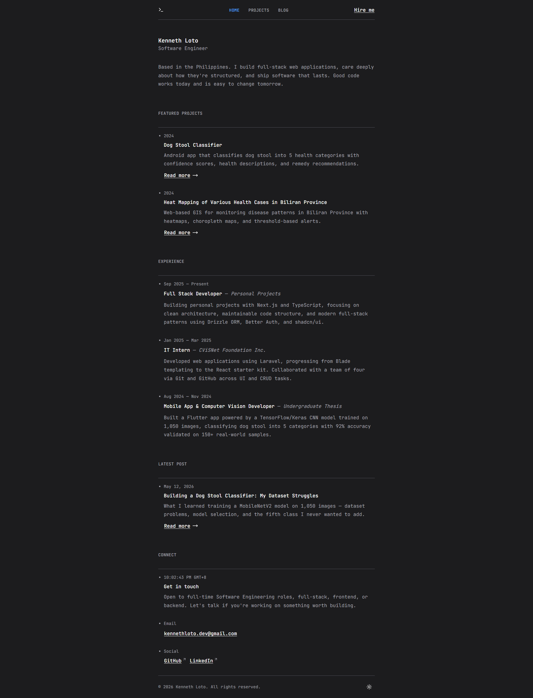

# Portfolio Lite

A minimal, fast personal portfolio built with Next.js, Tailwind CSS, and shadcn/ui. Monospace-themed for a dev-native feel. Blog and projects are MDX-powered via Content Collections — content is compiled at build time, so pages load fast with no runtime parsing.

🌐 **Live Demo:** [your-portfolio-url.com](https://your-portfolio-url.com)



## Tech Stack

- **Framework:** [Next.js 16](https://nextjs.org) (App Router)
- **Language:** [TypeScript](https://www.typescriptlang.org)
- **Styling:** [Tailwind CSS v4](https://tailwindcss.com)
- **UI Components:** [shadcn/ui](https://ui.shadcn.com), [base-ui](https://base-ui.com)
- **Content:** [Content Collections](https://www.content-collections.io) (MDX — blog + projects)
- **Linting & Formatting:** [Biome](https://biomejs.dev)
- **Package Manager:** [Bun](https://bun.sh)
- **Git Hooks:** [Husky](https://typicode.github.io/husky/), [commitlint](https://commitlint.js.org/)

## Features

- Monospace font throughout for a dev-native aesthetic
- Dark/light mode toggle with system preference detection
- Mobile-responsive with shadcn/ui Sheet for navigation
- MDX blog and project pages with syntax highlighting via Shiki
- Reading time estimates on blog posts and projects
- Auto-updating local time display
- Dynamic OG image generation for blog posts and projects
- RSS feed for blog posts
- Auto-generated sitemap and robots.txt
- PWA manifest
- SEO-validated frontmatter (title, description, tags with length constraints)
- Test suite with Vitest + Testing Library (hooks, lib utilities)
- Strict linting with Biome and conventional commit enforcement via commitlint

## File Structure

```
portfolio-lite/
├── app/
│   ├── (marketing)/          # Route group: blog, projects, home
│   │   ├── blog/
│   │   │   ├── [slug]/page.tsx
│   │   │   └── page.tsx
│   │   ├── projects/
│   │   │   ├── [slug]/page.tsx
│   │   │   ├── layout.tsx
│   │   │   └── page.tsx
│   │   ├── layout.tsx
│   │   └── page.tsx
│   ├── og/route.tsx          # Open Graph image generation
│   ├── rss/route.ts          # RSS feed
│   ├── globals.css
│   ├── layout.tsx
│   ├── manifest.json
│   ├── not-found.tsx
│   ├── robots.ts
│   └── sitemap.ts
├── components/
│   ├── pages/
│   │   ├── blog-detail-page.tsx
│   │   └── projects-detail-page/
│   │       ├── image-carousel.tsx
│   │       └── index.tsx
│   ├── sections/             # Hero, experience, connect, featured-projects, latest-post
│   ├── shared/
│   │   ├── footer.tsx
│   │   └── header/           # Header, mobile nav, nav links, logo
│   ├── skeletons/            # Loading skeletons (local-time, mode-toggle)
│   ├── ui/                   # shadcn/ui base components
│   ├── local-time.tsx
│   ├── mode-toggle.tsx
│   ├── share-button.tsx
│   ├── theme-provider.tsx
│   └── theme.ts
├── content/
│   ├── blog/                 # MDX blog posts
│   └── projects/             # MDX project pages
├── hooks/
│   ├── __tests__/
│   ├── use-local-time.ts
│   ├── use-mounted.ts
│   ├── use-scroll-to.ts
│   ├── use-scroll-to-top.ts
│   └── use-share.ts
├── lib/
│   ├── __tests__/
│   ├── data/                 # Static data: about-me, nav, social-media, work-experience
│   ├── posts.ts
│   ├── projects.ts
│   ├── types.ts
│   └── utils.ts
├── public/
│   ├── fonts/                # JetBrains Mono (local font)
│   └── images/               # Avatar, preview, project screenshots
├── .husky/                   # Git hooks (commit-msg, pre-commit, pre-push)
├── AGENTS.md
├── biome.json
├── commitlint.config.ts
├── components.json
├── content-collections.ts
├── LICENSE.md
├── next.config.ts
├── package.json
├── postcss.config.mjs
├── tsconfig.json
├── vitest.config.ts
└── vitest.setup.ts
```

## Getting Started

### Prerequisites

- [Bun](https://bun.sh) or Node.js 18+

### Installation

```bash
bun install
bun dev
```

Open [http://localhost:3000](http://localhost:3000).

### Build

```bash
bun run build
bun run start
```

## Scripts

| Command                       | Description                                |
| ----------------------------- | ------------------------------------------ |
| `bun dev`                     | Start development server                   |
| `bun run build`               | Build content collections + production app |
| `bun run lint`                | Check code with Biome                      |
| `bun run lint:fix`            | Auto-fix linting issues                    |
| `bun run lint:fix:unsafe`     | Auto-fix with unsafe transforms            |
| `bun run format`              | Format code with Biome                     |
| `bun run typecheck`           | Run TypeScript type checking               |
| `bun test`                    | Run tests in watch mode                    |
| `bun test:run`                | Run tests once                             |
| `bun test:coverage`           | Run tests with coverage report             |
| `bun run ui`                  | Add shadcn/ui components                   |
| `bun run content-collections` | Build content collections manually         |

## Customization

### Personal Info

Update your details in `lib/data/`:

- `about-me.ts` — Name, bio, avatar, email
- `nav.ts` — Navigation links
- `social-media.ts` — Social profiles
- `work-experience.ts` — Work history

### Adding Blog Posts

Create a `.mdx` file in `content/blog/`. Use `content/blog/_template.mdx` as a starting point. Frontmatter is validated at build time — see `content-collections.ts` for the full schema and character limits.

### Adding Projects

Create a `.mdx` file in `content/projects/`. Same frontmatter validation applies. Place project screenshots in `public/images/projects/` — missing images will cause a build error.

## Deployment

Deploy to [Vercel](https://vercel.com/new) by importing the repository. No environment variables required for the base setup.

## License

MIT — see [LICENSE](LICENSE).
