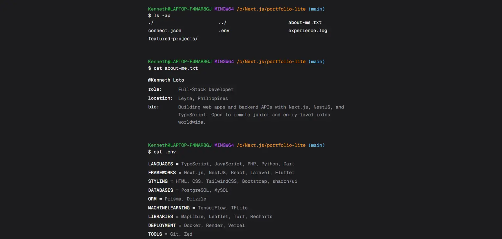

# Portfolio Lite

A single-page personal portfolio styled as a Windows Git Bash terminal session. Built with Next.js 16 and Tailwind CSS v4 — no blog, no CMS, no content collections. Just a prompt, a command, and output.

🌐 **Live Demo:** [www.kennethloto.dev](https://www.kennethloto.dev)



## Tech Stack

- **Framework:** [Next.js 16](https://nextjs.org) (App Router, Turbopack)
- **Language:** [TypeScript](https://www.typescriptlang.org)
- **Styling:** [Tailwind CSS v4](https://tailwindcss.com) (Terminal theme, OKLCH tokens)
- **Font:** [Geist Mono](https://vercel.com/font) via `next/font/google`
- **Linting & Formatting:** [Biome](https://biomejs.dev)
- **Package Manager:** [Bun](https://bun.sh)
- **Error Tracking:** [Sentry](https://sentry.io) (client, edge, server)
- **Analytics:** [Vercel Analytics](https://vercel.com/analytics) + [Speed Insights](https://vercel.com/speed-insights)
- **Git Hooks:** [Husky](https://typicode.github.io/husky/), [commitlint](https://commitlint.js.org/)

## Features

- Terminal-themed UI: prompt line, `$ cat` commands, monospace output
- OG image generation via `@vercel/og` (Edge runtime, Geist Mono TTFs)
- Sitemap, robots.txt, PWA manifest, JSON-LD structured data
- Security headers (CSP, HSTS, X-Frame-Options, etc.)
- Sentry error capture (client + server)
- Vercel Analytics & Speed Insights

## File Structure

```
portfolio-lite/
├── app/
│   ├── og/
│   │   └── route.tsx          # OG image generation (Edge runtime)
│   ├── error.tsx              # Client error boundary (terminal theme)
│   ├── global-error.tsx       # Root error boundary (inline styles)
│   ├── globals.css            # Tailwind v4 theme, OKLCH tokens
│   ├── layout.tsx             # Root layout, metadata, JSON-LD
│   ├── manifest.json
│   ├── not-found.tsx          # 404 page (terminal theme)
│   ├── page.tsx               # Single-page layout (6 sections)
│   ├── robots.ts
│   └── sitemap.ts             # Single-URL sitemap
├── components/
│   ├── sections/              # Page sections (hero, about-me, etc.)
│   │   ├── about-me.tsx
│   │   ├── connect.tsx
│   │   ├── experience.tsx
│   │   ├── featured-projects.tsx
│   │   ├── hero.tsx
│   │   └── technical-skills.tsx
│   └── ui/
│       └── section.tsx        # Terminal primitives (Section, SectionPwd, etc.)
├── lib/
│   ├── data/                  # Static content (JSON data objects)
│   │   ├── about-me.ts
│   │   ├── connect.ts
│   │   ├── experience.ts
│   │   ├── featured-projects.ts
│   │   └── technical-skills.ts
│   ├── og.ts                  # OG image paths & helpers
│   └── utils.ts               # cn(), ogUrl(), getAutoGridColumnWidth()
├── types/                     # TypeScript interfaces for all data
│   ├── about-me.ts
│   ├── connect.ts
│   ├── experience.ts
│   ├── featured-projects.ts
│   └── technical-skills.ts
├── public/
│   ├── fonts/                 # Geist Mono TTF files (for @vercel/og)
│   ├── image/                 # Preview, verification files
│   └── web-app-manifest-*.png
├── .github/workflows/         # CI (Biome lint), CodeQL, auto-target-develop
├── .husky/                    # Git hooks (commit-msg)
├── AGENTS.md
├── CLAUDE.md
├── DESIGN.md                  # Terminal theme design system
├── UI-REGISTRY.md             # Visual pattern registry
├── MEMORY.md                  # Session continuity log
├── biome.json
├── commitlint.config.ts
├── instrumentation.ts         # Sentry instrumentation
├── next.config.ts
├── package.json
├── renovate.json
├── sentry.client.config.ts
├── sentry.edge.config.ts
├── sentry.server.config.ts
└── tsconfig.json
```

## Getting Started

### Prerequisites

- [Bun](https://bun.sh) or Node.js 18+

### Installation

```bash
bun install
bun dev
```

Open [http://localhost:3000](http://localhost:3000).

### Build

```bash
bun run build
bun run start
```

## Scripts

| Command                       | Description                  |
| ----------------------------- | ---------------------------- |
| `bun dev`                     | Start development server     |
| `bun run build`               | Build production app         |
| `bun run lint`                | Check code with Biome        |
| `bun run lint:fix`            | Auto-fix linting issues      |
| `bun run lint:fix:unsafe`     | Auto-fix with unsafe transforms |
| `bun run format`              | Format code with Biome       |
| `bun run typecheck`           | Run TypeScript type checking |

## Customization

Update your details in `lib/data/`. Each file exports a typed object consumed by the corresponding section component. Types are in `types/` and must match.

| Data file | Content |
|---|---|
| `lib/data/about-me.ts` | Name, title, location, bio |
| `lib/data/connect.ts` | Email, LinkedIn, GitHub |
| `lib/data/experience.ts` | Work history (title, company, period, description) |
| `lib/data/featured-projects.ts` | Projects (title, description, tags, GitHub URL) |
| `lib/data/technical-skills.ts` | Skill categories grouped by key |

The prompt line defaults are in `components/ui/section.tsx` (`SectionPwd` component props). Branch names, paths, and user/host can be changed per-page via props.

## Design

The entire site follows a Windows Git Bash / MINGW64 terminal session metaphor. See `DESIGN.md` for the full design system — color tokens, typography, spacing rhythm, component inventory, and rules about what not to do (no icons, no rounded corners, no third font weight).

## Deployment

Deployed via [Vercel CLI](https://vercel.com/docs/cli):

```bash
bunx vercel --prod
```

Required environment variables:

| Variable | Source |
|---|---|
| `SENTRY_AUTH_TOKEN` | Sentry |

## License

MIT — see [LICENSE](LICENSE).
